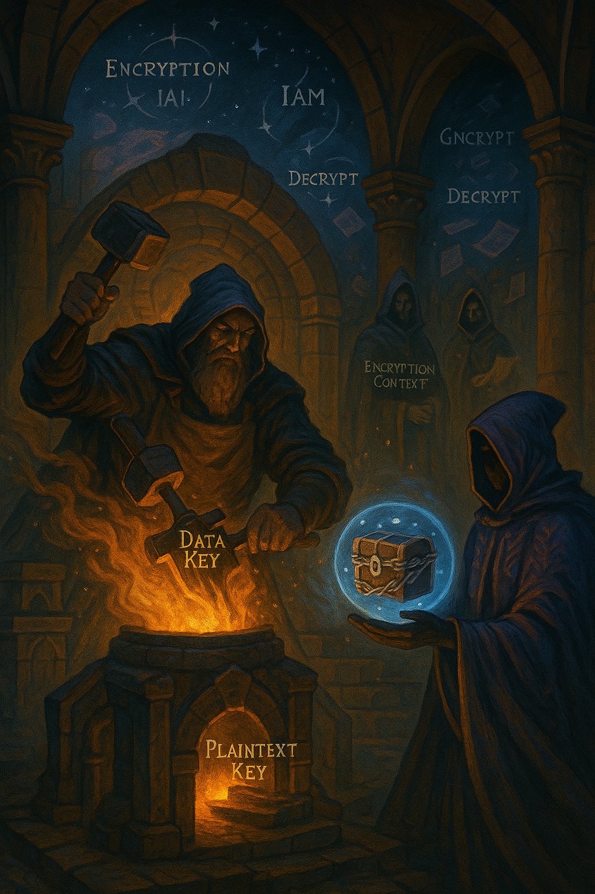

# AWS KMS Hands-On Workshop

This repository contains a practical workshop on AWS Key Management Service (KMS), designed to be completed in under 15 minutes using the AWS CLI.

## Overview

AWS Key Management Service (KMS) is a managed service that makes it easy for you to create and control the encryption keys used to encrypt your data. This workshop provides hands-on experience with KMS, focusing on envelope encryption - a security best practice for protecting sensitive data.

## What You'll Learn

- How to create and manage KMS keys
- How to implement envelope encryption
- How to encrypt and decrypt data using KMS
- How to work with data keys and encryption contexts

## Prerequisites

- An AWS account
- AWS CLI installed and configured
- Basic familiarity with command line operations

## Workshop Environment

You can run this workshop in one of two ways:

1. **Local Machine**: If you have AWS CLI installed locally
2. **AWS CloudShell**: A browser-based shell with AWS CLI pre-installed

## Getting Started

1. Clone this repository
2. Follow the instructions in [step-by-step-demo-guide.md](step-by-step-demo-guide.md)

## Workshop Files

- `kms-workshop.yaml`: CloudFormation template to set up required resources
- `step-by-step-demo-guide.md`: Detailed instructions for the workshop

## Security Note

This workshop is for educational purposes. In a production environment, you would implement additional security controls and follow AWS security best practices.

## Clean Up

Don't forget to clean up resources after completing the workshop to avoid unnecessary charges.